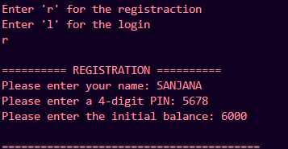
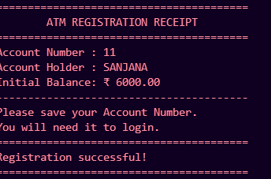
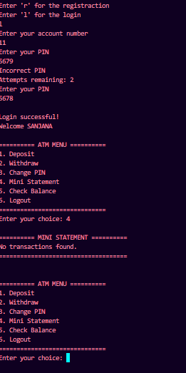
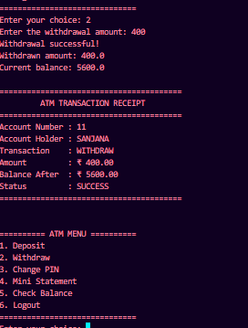
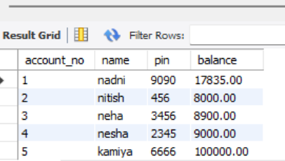
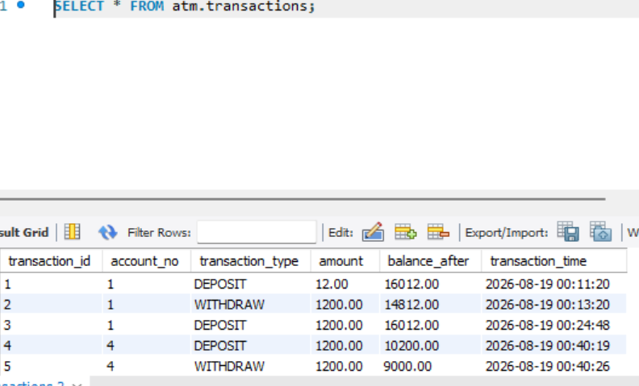

# 🏧 ATM Management System

A console-based ATM Management System developed using Python and MySQL.

## 🚀 Features

- User Registration
- Automatic Account Number Generation
- Account Number + PIN Login
- Login Attempt Limitation
- Check Balance
- Deposit Money
- Withdraw Money
- Change PIN
- Mini Statement
- Transaction History
- Transaction Receipt
- Input Validation
- MySQL Database Integration
- Environment Variables for Database Credentials

## 🛠️ Technologies Used

- Python
- Object-Oriented Programming (OOP)
- MySQL
- MySQL Connector/Python
- python-dotenv

## 🗄️ Database

The project uses MySQL for storing account and transaction data.

### Users Table

Stores:

- Account Number
- Account Holder Name
- PIN
- Balance

### Transactions Table

Stores:

- Transaction ID
- Account Number
- Transaction Type
- Amount
- Balance After
- Transaction Time

## 🔐 Security

Database credentials are stored using environment variables through a `.env` file.

The `.env` file is excluded from Git using `.gitignore`.

## ▶️ How to Run

### 1. Clone the repository

```bash
git clone https://github.com/nandni-codes/ATM-Management-System.git

## 📸 Project Screenshots

### Registration


### Registration Successful / Account Details


### Login


### Logout


### Transaction


### Users Database


### Transactions Database
